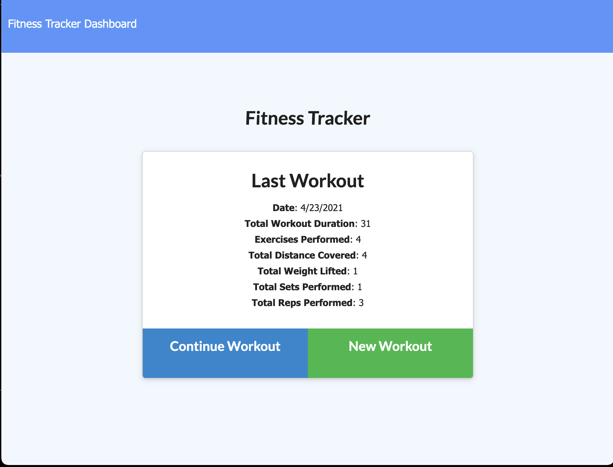
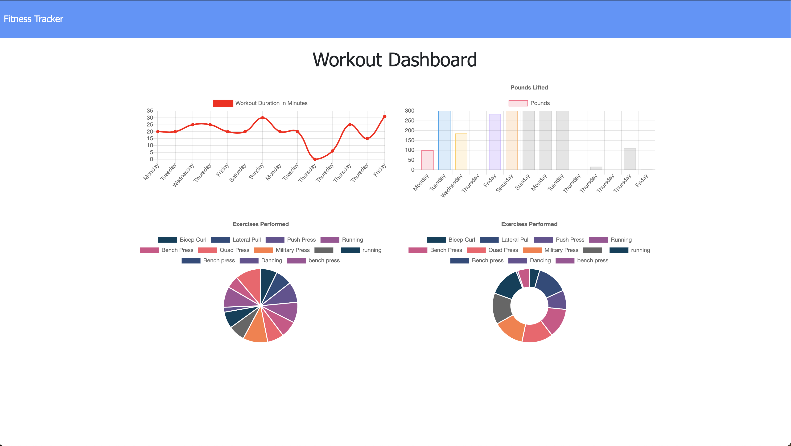

# workout-tracker
## Description
Tracking progress is the key to success for any journey! Inspired by a year of staying at home behind a screen, this application allows users on fitness journey to store and organize their workout data in order to gain insight on their progress and successfully reach fitness goals. 

## Table of Contents
- [Description](#Description)
- [Deployment](#Deployment)
- [Usage](#Usage)
- [Features](#Features)
- [Credits](#Credits)
- [Contributing](#Contributing)
- [License](#License)
  

## Deployment
- [Heroku Deployment](https://frozen-shelf-11982.herokuapp.com)
- [GitHub Repo](https://github.com/jareddeuriarte/workout-tracker)
  

  
 
### Usage
- Upon visiting the site, add a workout by clicking 'New Workout'! 
- Answer the exercise prompts, and click 'Add Exercise'
- Once you have completed the exercise, hit 'Complete'. 
- In the top left corner of the page, hit 'Dashboard' to view all of your workout history. 
- Last, shred!

### Features
- MongoDB technology
- Node.js technology
- npm exress
- npm mongoose

 
### Credits  
My tutor Namita.

### Contributing
Forks are welcome!

### License 
This project is licensed under MIT.

### Badges

  
### Questions?
Reach me at:
- [GitHub](https://github.com/jareddeuriarte)
- deuriartejared@gmail.com

